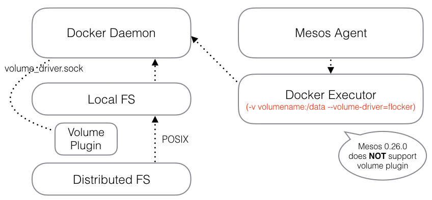

## Docker Volume Plugin

### Overview of Docker volume plugin

When 

    docker -v volume_point:/path_in_docker --volume-driver volume_dirver

Docker communicate with volume plugin by `volume_driver.sock`, a unix domain socket in special directory. 

###API of Volume Plugin:

## Kubernetes Volume

